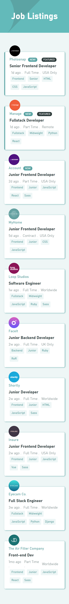
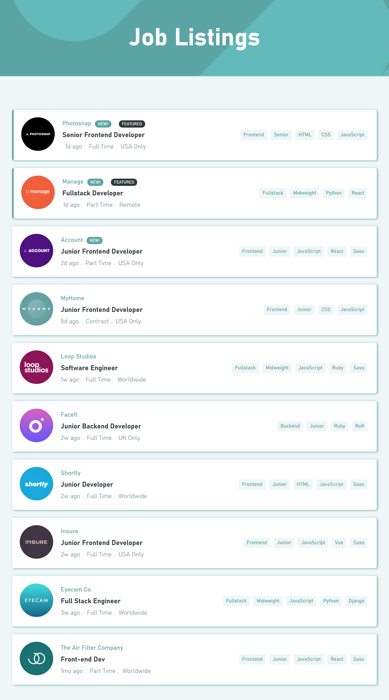

# Frontend Mentor - Job listings with filtering solution

This is a solution to the [Job listings with filtering challenge on Frontend Mentor](https://www.frontendmentor.io/challenges/job-listings-with-filtering-ivstIPCt). Frontend Mentor challenges help you improve your coding skills by building realistic projects. 

## Table of contents

- [Overview](#overview)
  - [The challenge](#the-challenge)
  - [Screenshot](#screenshot)
  - [Links](#links)
- [My process](#my-process)
  - [Built with](#built-with)
  - [What I learned](#what-i-learned)

  
## Overview

This project displays a list of developer jobs available according to given/available data. It first pulls data from a local data.json file and then displays the available jobs on the page with the roles, time posted, location, level, languages, tools and so on. These jobs can then be filtered by clicking on the tags for each job.

### The challenge

Users should be able to:

- View the optimal layout for the site depending on their device's screen size
- See hover states for all interactive elements on the page
- Filter job listings based on the categories

### Screenshots

### Links

- Solution URL: [Add solution URL here](https://your-solution-url.com)
- Live Site URL: (https://ikennaezef.github.io/static-job-listings/)

## My process

### Built with

- Semantic HTML5 markup
- CSS custom properties
- Flexbox
- CSS Grid
- Mobile-first workflow
- React - A JavaScript Library

### What I learned

On this challenge, I got to improve my knowledge on the React Library, react component props and some React Hooks - esp. the useState and useEffect hooks. I'm also getting more comfortable with writing ES6 standard Javascript. 
